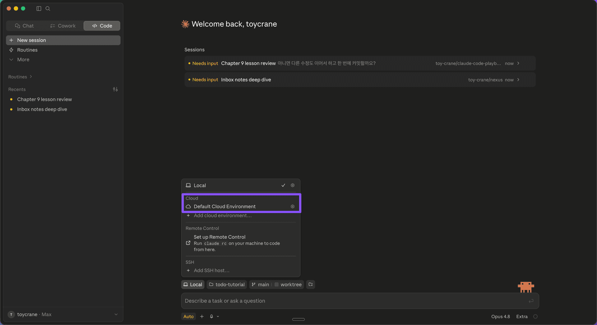
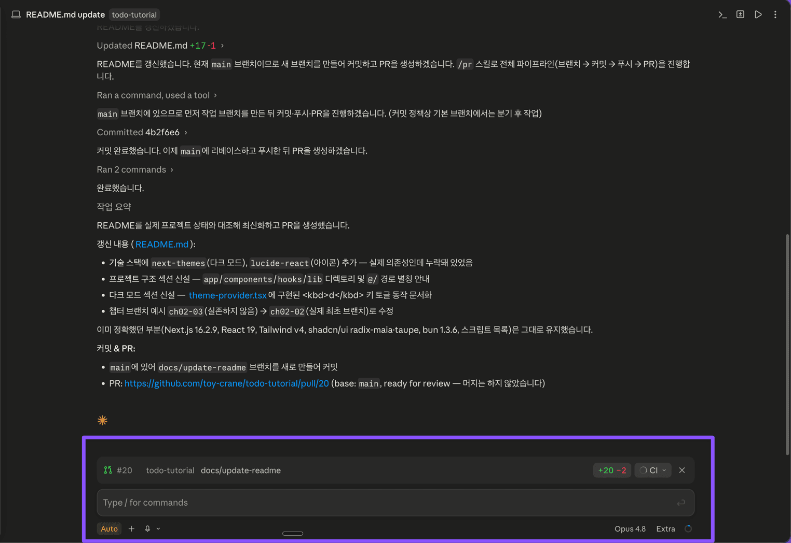

# Claude Code Cloud 세션 | 제대로 배우기

Part 3 · 프로젝트 완성하기Chapter 9 · Claude Code Desktop

# 노트북을 덮어도 계속되는 세션 | Cloud 세션

이미 배포한 내 저장소로 Cloud 세션을 열어 README를 수정하고 PR을 만들어 봅니다

Copy MarkdownOpen

마지막 업데이트: 2026\. 7. 7.

## [Overview](#overview)

Cloud 세션은 내 컴퓨터를 원격 조종하는 기능이 아닙니다. GitHub에 올라간 저장소를 새 환경에 가져와 Anthropic의 클라우드에서 실행합니다. 이 레슨을 읽으면 이미 GitHub에 올려둔 내 Todo 저장소로 Cloud 세션을 열어, README를 수정하고 PR을 만드는 흐름을 한 번 경험할 수 있습니다.

### [학습 목표](#학습-목표)

*   실행 위치를 로컬에서 Cloud로 옮겨 세션을 시작합니다.
*   로컬 환경 변수와 Cloud environment의 차이를 구별합니다.
*   Cloud 세션에서 README를 수정하고 PR까지 만듭니다.

### [시작하기 전 확인사항](#시작하기-전-확인사항)

*   Cloud 세션이 가능한 Claude 구독 (Pro·Max·Team, [사전 준비사항](/learn/prerequisites) 7번 항목)
*   [Part 2 배포 레슨](/learn/extending-claude/deploy-todo)에서 GitHub에 올린 본인 Todo 저장소 (`main` 브랜치)

## [\[미션\] Cloud 세션으로 README 최신화하기](#미션-cloud-세션으로-readme-최신화하기)

이미 GitHub에 올려둔 Todo 저장소로 Cloud 세션을 열어, README를 수정하고 PR을 만드는 흐름을 한 바퀴 돌아 봅니다. 오래 걸리는 작업이 목적이 아니라, Cloud에서 저장소를 읽고 수정하고 PR을 만드는 흐름을 확인하는 것이 목적입니다.

### [Step 1: Cloud 환경으로 세션 열기](#step-1-cloud-환경으로-세션-열기)

새 세션을 만들 때 Environment를 Cloud로 고르고, [Part 2에서 배포한 내 저장소](/learn/extending-claude/deploy-todo)와 `main` 브랜치를 선택합니다.



GitHub이 아직 Cloud에 연결되지 않았다면, 이때 연결 안내가 뜹니다. Claude GitHub App을 설치하고 저장소 접근을 허용하면 연결이 끝납니다. 처음 한 번만 하면 됩니다.

### [Step 2: README 최신화 맡기기](#step-2-readme-최신화-맡기기)

Cloud 세션에 다음 프롬프트를 입력합니다.

```
README.md를 현재 프로젝트에 맞게 최신화해줘.
수정이 끝나면 커밋한 뒤 PR을 만들어줘.
```

앱을 닫아도 Cloud 세션은 계속 실행됩니다. 작업이 끝나면 세션을 열어 어떤 파일을 바꿨는지, 어떤 명령을 실행했는지, 어떤 PR을 만들었는지 확인합니다.

### [Step 3: PR 검토하고 머지하기](#step-3-pr-검토하고-머지하기)

PR이 만들어지면 세션 하단에 PR 상태 바가 나타납니다. PR 번호, 브랜치, 변경 규모(`+20 -2`)와 CI 검사 상태를 세션을 벗어나지 않고 바로 봅니다. `gh`가 설치·인증돼 있어야 동작합니다 ([사전 준비사항](/learn/prerequisites) 6번 항목).



여기서 GitHub으로 넘어가 PR을 엽니다. README diff를 보고 프로젝트 이름, 실행 방법, 테스트 명령이 현재 프로젝트와 맞는지 확인합니다.

문제가 없으면 GitHub에서 PR을 merge합니다. Cloud가 코드를 수정하고 PR까지 만들 수는 있지만, 마지막 판단은 사람이 합니다. Cloud 세션의 역할은 작업을 실행하고 검토 가능한 변경사항으로 올리는 데까지입니다.

모바일 앱에서 이어서 해보기 (선택)

Cloud 세션은 Anthropic 클라우드에서 실행되므로, Remote Control 설정 없이도 [claude.ai/code](https://claude.ai/code) 웹과 Claude 모바일 앱에 같은 세션으로 나타납니다. 앱을 설치했다면 방금 만든 세션을 모바일 앱에서 열어, PR 상태를 확인하거나 짧은 추가 지시를 보내 보세요.

## [Cloud 세션을 쓰는 이유](#cloud-세션을-쓰는-이유)

Cloud 세션의 이점은 실행이 내 컴퓨터에서 분리된다는 데서 나옵니다. 그래서 작업을 책상 앞에 붙잡아 두지 않아도 됩니다.

*   **노트북을 덮어도 계속됩니다.** 앱을 닫거나 컴퓨터를 꺼도 Cloud에서 작업이 이어집니다.
*   **어디서든 모바일 앱에서 확인하고 지시합니다.** 책상에 없어도 [claude.ai/code](https://claude.ai/code) 웹이나 Claude 모바일 앱으로 세션을 열어 진행 상황을 보고 이어서 지시합니다.
*   **컴퓨터에서 하던 작업을 모바일 앱으로 넘겨받습니다.** 책상에서 시작한 세션이 그대로 모바일 앱에 있어, 이동 중에도 검토하고 이어서 지시합니다.

대신 기준이 내 컴퓨터가 아니라 GitHub 저장소와 Cloud environment로 바뀝니다. 커밋된 파일과 `.claude/` 설정은 GitHub에서, API key 같은 값은 Cloud environment에서 읽고, 미커밋 변경이나 로컬 `.env`, 로컬 dev server는 넘어가지 않습니다.

## [핵심 포인트 정리](#핵심-포인트-정리)

1.  **GitHub 기준점**: Cloud 세션은 내 로컬 폴더가 아니라 GitHub에 push된 repository와 branch에서 시작합니다.
2.  **Cloud environment**: 로컬 환경 변수는 자동으로 넘어가지 않으므로, Cloud에서 필요한 값은 environment variables에 따로 넣습니다.
3.  **PR 흐름**: Cloud 세션은 저장소를 수정하고 커밋과 PR까지 만들 수 있으며, merge 전 최종 검토는 사람이 합니다.
4.  **어디서나 이어서**: Cloud 세션은 클라우드에서 실행되므로 노트북을 덮어도 계속되고, 모바일 앱·웹에서 같은 세션을 이어받습니다.

## [FAQ](#faq)

### 프로젝트에 API key 같은 환경 변수가 필요하면 어떻게 하나요?

### 모바일 앱에서 이어서 하려면 로컬 세션과 Cloud 세션이 어떻게 다른가요?

### SSH 환경은 언제 쓰나요?

## [이어서 배울 내용](#이어서-배울-내용)

지금까지는 Cloud 세션을 매번 손으로 열었습니다. 다음 [Routines 레슨](/learn/completing-projects/claude-code-desktop/routines)에서는 프롬프트와 저장소를 저장해두고 정해진 때마다 자동으로 도는 Cloud 루틴을 만들어, 이 작업을 자동화하는 방법을 배웁니다.

피드백 남기기

[

변경사항 바로 확인하기 | Diff와 Preview

Claude가 고친 줄에 라인 코멘트로 다시 요청하고, Preview로 실행 화면까지 세션 안에서 확인합니다

](/learn/completing-projects/claude-code-desktop/diff-and-preview)[

정해둔 시간에 알아서 | Routines

프롬프트와 저장소를 한 번 저장해두고 정해진 때에 스스로 도는 Cloud 루틴을 만들어 즉시 실행해 봅니다

](/learn/completing-projects/claude-code-desktop/routines)

---
Source: https://docs.claude-hunt.com/learn/completing-projects/claude-code-desktop/remote-sessions
