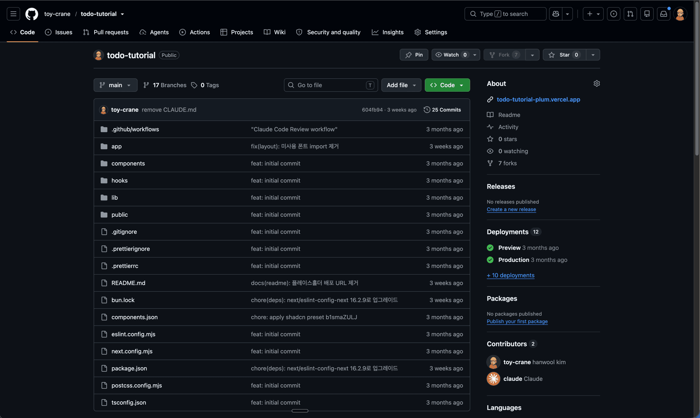
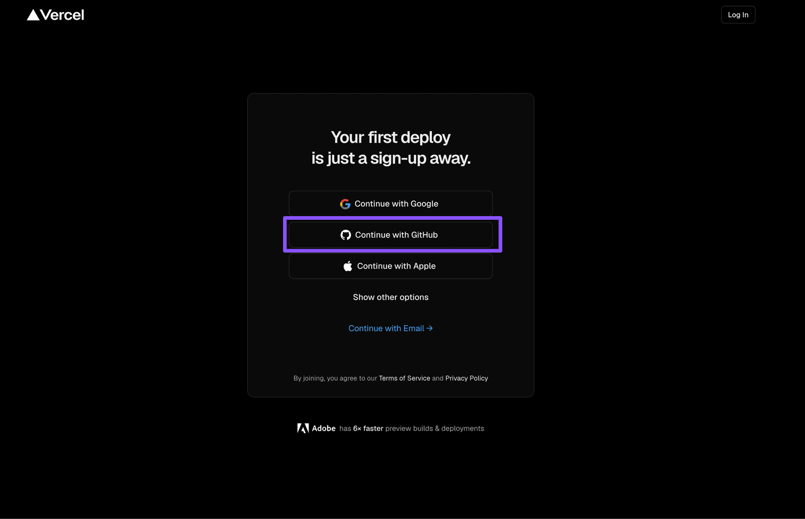
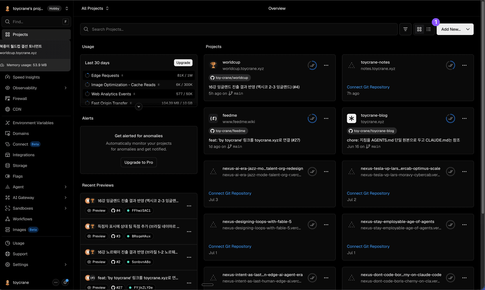
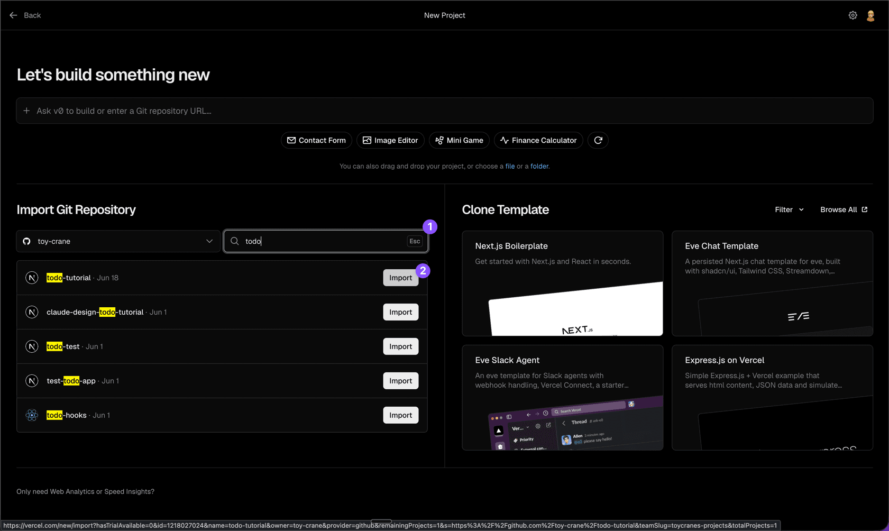
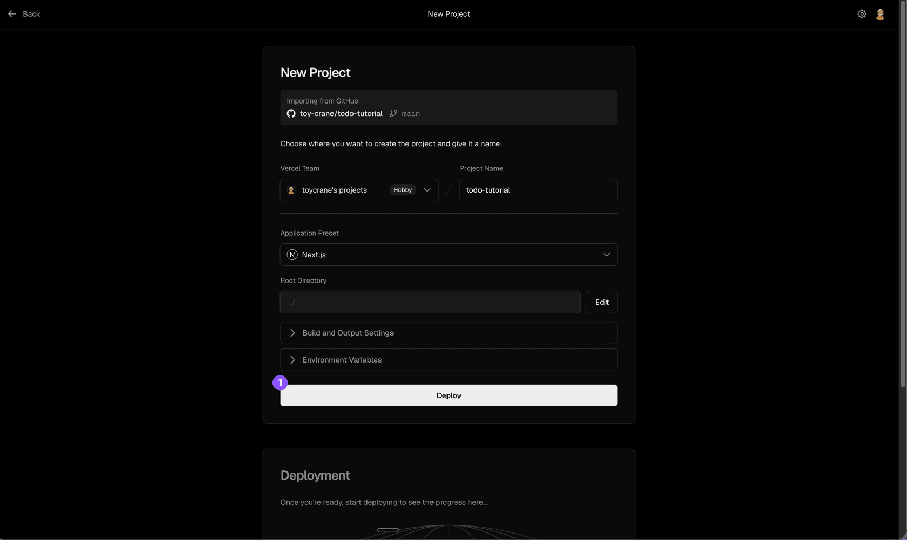
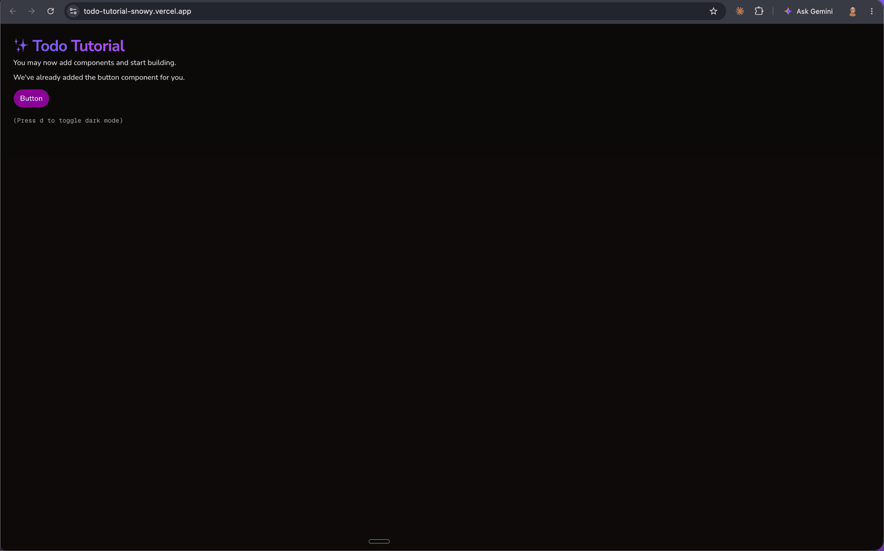

# Claude Code Vercel 배포 | 제대로 배우기

Part 2 · Claude 확장하기

# Todo 앱 배포하기 | Vercel 배포

강의 저장소에서 clone한 Todo를 본인 GitHub 저장소로 옮기고 Vercel에 연결해 누구나 접속하는 주소로 배포합니다

Copy MarkdownOpen

마지막 업데이트: 2026\. 7. 8.

## [Overview](#overview)

지금까지 만든 Todo는 강의 저장소를 clone해서 작업한 프로젝트라, 아직 내 GitHub 저장소에는 올라가 있지 않습니다. 이 레슨에서 Todo를 본인 GitHub 저장소로 옮기고 Vercel에 연결하면, 내가 만든 Todo가 누구나 접속하는 `.vercel.app` 주소에서 열립니다.

### [학습 목표](#학습-목표)

*   Todo의 `origin`을 강의 저장소에서 본인 GitHub 저장소로 바꿔 올립니다.
*   Vercel에 저장소를 연결해 `.vercel.app` 주소에서 화면이 뜨는지 확인합니다.
*   push 한 번이 배포로 이어지는 흐름을 설명할 수 있습니다.

### [시작하기 전 확인사항](#시작하기-전-확인사항)

*   GitHub CLI 인증: [사전 준비](/learn/prerequisites)에서 마친 `gh auth login` 상태를 그대로 씁니다.

## [로컬 실행과 배포](#로컬-실행과-배포)

지금까지 Todo는 `bun dev`로 내 노트북에서만 열렸습니다. 주소가 `localhost`라 나만 볼 수 있고, 터미널을 끄면 화면도 함께 닫힙니다. 이 화면을 누구나 접속하는 인터넷 주소로 올리는 일을 배포라고 합니다.

Vercel은 GitHub 저장소를 받아 배포를 대신 처리하는 서비스입니다. 저장소를 한 번 연결하면 코드를 빌드해 `.vercel.app` 주소로 띄우고, 이후 `main`에 push할 때마다 같은 주소를 자동으로 갱신합니다. Next.js를 만든 회사가 운영해서, Next.js로 만든 Todo는 따로 설정하지 않아도 그대로 배포됩니다.

## [Step 1: Todo를 내 저장소로 옮기기](#step-1-todo를-내-저장소로-옮기기)

지금까지 각 레슨은 `git checkout`으로 강의 저장소의 시작점을 받아 진행했습니다. 그래서 이 프로젝트의 `origin`은 내 것이 아니라 강의 저장소를 가리킵니다. 반면 Vercel은 내가 소유한 GitHub 저장소를 기준으로 배포합니다. 먼저 Todo를 내 저장소로 옮깁니다.

Claude Code에 다음과 같이 요청합니다.

```
이 프로젝트는 강의 저장소를 clone한 거라 origin이 강의 원본을 가리키고 있어.
내 GitHub 계정에 todo-tutorial public 저장소를 새로 만들고, origin을 그 저장소로 바꿔줘.
커밋 안 된 변경이 있으면 먼저 커밋한 뒤, 지금 작업 상태를 그대로 main 브랜치에 올려줘.
```

Claude는 내 계정에 새 저장소를 만들고, `origin`을 그 저장소로 바꾼 뒤 현재 작업을 `main`으로 push합니다. 이 단계가 끝나면 내 GitHub 계정에 Todo 코드가 담긴 새 저장소가 생깁니다. [github.com](https://github.com)에서 저장소를 열어 파일이 다 올라왔는지 확인합니다. 이 저장소가 뒤에서 Vercel에 연결할 대상입니다.

저장소 이름은 원하는 대로 바꿔도 됩니다.

gh 인증이 안 되어 있다면

Claude가 저장소를 만들려면 GitHub CLI 인증이 필요합니다. `gh auth status`로 확인하고, 로그인이 안 되어 있으면 `gh auth login`을 먼저 실행합니다.



## [Step 2: Vercel 계정 만들기](#vercel-signup)

[vercel.com](https://vercel.com)을 열고 Sign Up을 클릭합니다. Continue with GitHub를 고른 뒤 이어지는 화면에서 Authorize를 누르면 가입이 끝납니다. 사전 준비에서 만든 GitHub 계정을 그대로 써서 새로 입력할 정보는 없습니다.



가입을 마치면 Vercel 대시보드가 열립니다.

## [Step 3: Vercel에 저장소 연결하기](#step-3-vercel에-저장소-연결하기)

Vercel 대시보드에서 ① Add New... 드롭다운을 열고, 메뉴에서 Project를 클릭합니다.



① Search 박스에 저장소 이름을 입력해 방금 만든 저장소를 찾고, ② 옆의 Import 버튼을 클릭합니다.



다음 화면에서 Application Preset은 Next.js로 자동 감지됩니다. Todo는 외부 키 없이 브라우저에서 동작하므로 Environment Variables는 비워둔 채 ① Deploy 버튼을 클릭합니다.



## [Step 4: 배포 주소에서 Todo 확인하기](#step-4-배포-주소에서-todo-확인하기)

빌드가 끝나면 저장소 이름이 들어간 `.vercel.app` 주소가 생깁니다. 주소를 열어 로컬과 같은 Todo 화면이 뜨는지 확인합니다.



내 노트북에서만 실행되던 Todo가 인터넷에 올라갔습니다. 이제 이 주소를 누구에게든 공유할 수 있는 상태가 되었습니다.

## [핵심 포인트 정리](#핵심-포인트-정리)

**push 한 번이 배포**: Vercel을 한 번 연결하면 이후 `main`에 push할 때마다 `.vercel.app` 주소가 자동으로 갱신됩니다.

## [FAQ](#faq)

### 강의 챕터를 다시 보려면 어떻게 하나요?

### 저장소를 private으로 만들어도 되나요?

## [이어서 배울 내용](#이어서-배울-내용)

Todo를 내 저장소로 옮기고 배포까지 마쳤습니다. [Part 2 정리](/learn/extending-claude/wrap-up)에서 지금까지 Claude를 확장한 도구들을 한 번에 되짚어 봅니다.

피드백 남기기

[

역할이 아니라 컨텍스트 격리 | Custom Agent

서브에이전트가 역할 분담이 아니라 컨텍스트 오염을 격리하는 도구임을 이해하고, \`.claude/agents/\`에 test-planner를 직접 만들어 봅니다

](/learn/extending-claude/execution-control/custom-agent)[

Part 2 정리

Part 2에서 배운 What vs How, Context 품질 도구(Rules/Commands/Skills), 외부 연결(CLI/MCP), 실행 제어(Hooks/Custom Agent)를 정리합니다

](/learn/extending-claude/wrap-up)

---
Source: https://docs.claude-hunt.com/learn/extending-claude/deploy-todo
