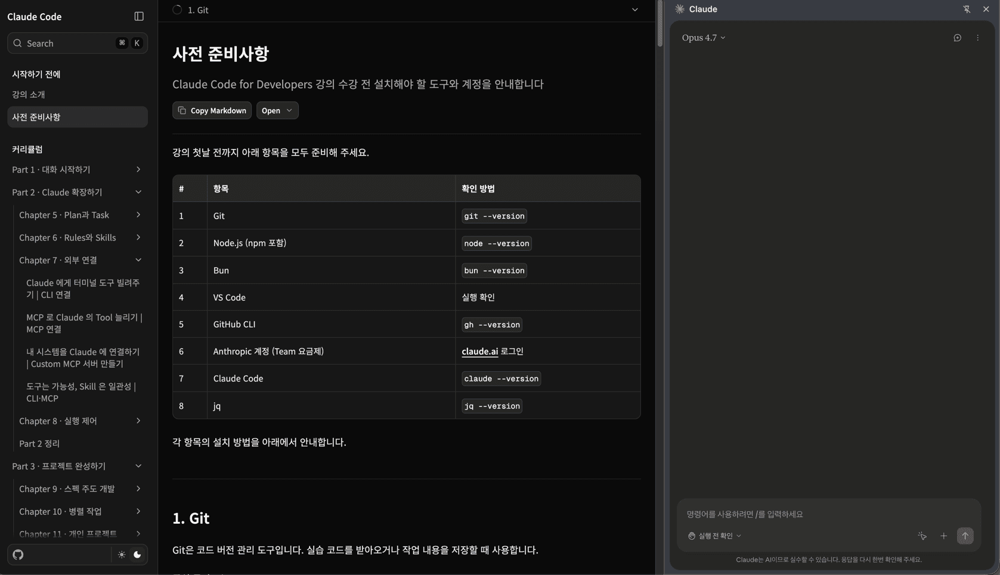

# Claude Code 사전 준비사항 | 제대로 배우기

# 사전 준비사항

Claude Code for Developers 강의 수강 전 설치해야 할 도구와 계정을 안내합니다

Copy MarkdownOpen

마지막 업데이트: 2026\. 7. 6.

강의 첫날 전까지 아래 항목을 모두 준비해 주세요.

#

항목

확인 방법

1

VS Code

실행 확인

2

Git

`git --version`

3

Homebrew (macOS)

`brew --version`

4

Node.js (npm 포함)

`node --version`

5

Bun

`bun --version`

6

GitHub CLI · GitHub 계정

`gh --version`, [github.com](https://github.com) 가입

7

Anthropic 계정

[claude.ai](https://claude.ai) 로그인

8

Claude Code

`claude --version`

9

Claude 데스크톱 앱

앱 실행 후 로그인

10

Claude in Chrome 확장

Chrome 툴바 아이콘 클릭 후 로그인 화면 확인

각 항목의 설치 방법을 아래에서 안내합니다.

설치 확인에 나오는 버전 번호는 예시입니다. 숫자가 표시되면 정상이며, 예시와 정확히 같지 않아도 됩니다.

* * *

## [1\. VS Code](#1-vs-code)

VS Code는 이 강의에서 사용하는 코드 편집기입니다. 이후 모든 설치 명령을 VS Code 내장 터미널에서 실행하니 가장 먼저 설치합니다.

[code.visualstudio.com](https://code.visualstudio.com)에 접속하면 운영체제에 맞는 버전을 바로 받을 수 있습니다. 다운로드 후 설치합니다.

### [설치 확인](#설치-확인)

설치 후 VS Code를 실행하면 환영 화면이 뜹니다.

### [터미널 여는 법](#터미널-여는-법)

터미널은 명령어를 한 줄씩 입력하는 창입니다. 이 문서의 모든 설치 명령은 VS Code 내장 터미널에서 실행합니다. VS Code 상단 메뉴에서 `Terminal` → `New Terminal`을 선택하거나, 단축키 `Ctrl` + 백틱(`` ` ``)을 누르면 터미널이 열립니다. macOS에서는 `Cmd` + `J`로 터미널 패널을 여닫을 수도 있습니다.

Windows: 터미널이 PowerShell인지 확인하세요

VS Code 터미널 탭에 "powershell" 또는 "pwsh"가 표시되어야 합니다. cmd 등 다른 셸이 표시되면 터미널 우측 상단 `+` 옆 드롭다운에서 PowerShell을 선택합니다. 이 강의의 Windows 설치 명령은 PowerShell에서 실행합니다.

* * *

## [2\. Git](#2-git)

Git은 코드 버전 관리 도구입니다. 실습 코드를 받아오거나 작업 내용을 저장할 때 사용합니다.

macOSWindows

macOS에는 Git이 기본으로 설치되어 있는 경우가 많습니다. 터미널에서 `git --version`으로 설치 여부를 확인합니다. 설치되어 있지 않으면 Xcode Command Line Tools 설치를 안내하는 팝업이 나타납니다. **Install**을 클릭하면 Git이 자동으로 설치됩니다.

[git-scm.com/downloads](https://git-scm.com/downloads)에서 Windows 설치 파일을 다운로드하고 실행합니다. 설치 중 옵션이 나오면 기본값(Next)으로 넘어가면 됩니다.

### [설치 확인](#설치-확인-1)

터미널에서 다음 명령어를 실행합니다.

```
git --version
```

아래와 같이 버전 번호가 표시되면 정상입니다.

```
git version 2.47.1
```

자세한 내용은 [공식 문서](https://git-scm.com)에서 확인할 수 있습니다.

* * *

## [3\. Homebrew (macOS)](#3-homebrew-macos)

Homebrew는 macOS용 패키지 매니저입니다. 다음 단계에서 Node.js, Bun, GitHub CLI를 설치할 때 사용합니다. Windows 사용자는 이 단계를 건너뛰고 4번 Node.js로 가세요.

macOSWindows

터미널에서 다음 명령어를 실행합니다. 설치 중 비밀번호 입력이나 안내가 나오면 화면 지시를 따릅니다.

```
/bin/bash -c "$(curl -fsSL https://raw.githubusercontent.com/Homebrew/install/HEAD/install.sh)"
```

Windows는 Homebrew가 필요 없습니다. 4번 Node.js로 가세요.

### [설치 확인](#설치-확인-2)

터미널에서 다음 명령어를 실행합니다.

```
brew --version
```

아래와 같이 버전 번호가 표시되면 정상입니다.

```
Homebrew 4.4.0
```

### 설치 후 brew를 찾을 수 없는 경우 (Apple Silicon)

자세한 내용은 [공식 문서](https://brew.sh)에서 확인할 수 있습니다.

* * *

## [4\. Node.js (npm 포함)](#4-nodejs-npm-포함)

Node.js는 JavaScript 런타임이며, 설치하면 패키지 매니저인 **npm**과 패키지 실행 도구인 npx가 함께 설치됩니다. 강의에서 다루는 MCP 서버와 일부 보조 도구는 `npx`로 실행하니 함께 설치해 주세요.

macOSWindows

Homebrew로 설치합니다.

```
brew install node
```

[nodejs.org](https://nodejs.org)에서 LTS 버전을 다운로드하고 설치합니다. 설치 중 옵션이 나오면 기본값(Next)으로 넘어가면 됩니다.

### [설치 확인](#설치-확인-3)

터미널에서 다음 명령어를 실행합니다.

```
node --version
npm --version
```

아래와 같이 버전 번호가 표시되면 정상입니다.

```
v22.14.0
10.9.2
```

Node.js를 설치하지 않으면 자주 만나는 오류

아래와 같은 메시지가 보인다면 대부분 Node.js/npm 미설치가 원인입니다.

*   macOS / Linux: `command not found: npx` 또는 `command not found: npm`
*   Windows PowerShell: `'npx' 용어가 cmdlet, 함수, 스크립트 파일... 인식되지 않습니다`
*   MCP 서버 설치/실행 시 `npx` 또는 `npm` 관련 오류

아래 설치 절차를 따라 Node.js를 설치한 뒤, 터미널을 닫았다가 다시 열어 주세요.

### Windows PowerShell에서 npx 실행 시 권한 오류가 나는 경우

자세한 내용은 [공식 문서](https://nodejs.org)에서 확인할 수 있습니다.

* * *

## [5\. Bun](#5-bun)

Bun은 빠른 JavaScript 런타임이자 패키지 매니저입니다. npm보다 패키지 설치가 수 배 빠르고, `bun run` 한 줄로 TypeScript 파일을 바로 실행할 수 있어 실습 흐름을 끊지 않습니다. 이 강의에서 프로젝트 생성과 실행에 사용합니다.

macOSWindows

Homebrew로 설치합니다.

```
brew install oven-sh/bun/bun
```

터미널에서 다음 명령어를 실행합니다.

```
irm bun.sh/install.ps1 | iex
```

설치가 끝나면 터미널을 닫았다가 다시 열어야 `bun`을 쓸 수 있습니다.

### [설치 확인](#설치-확인-4)

터미널에서 다음 명령어를 실행합니다.

```
bun --version
```

아래와 같이 버전 번호가 표시되면 정상입니다.

```
1.2.5
```

### Windows에서 스크립트 실행이 차단되는 경우

### Windows에서 설치 후 bun을 찾을 수 없는 경우

### Windows Defender가 차단하는 경우

자세한 내용은 [공식 문서](https://bun.com/docs/installation)에서 확인할 수 있습니다.

* * *

## [6\. GitHub CLI](#6-github-cli)

GitHub CLI(`gh`)는 터미널에서 Pull Request 생성, 이슈 관리 등 GitHub 작업을 처리하는 도구입니다. Claude Code가 코드를 push한 뒤 PR을 자동으로 생성하려면 `gh`가 필요합니다.

macOSWindows

```
brew install gh
```

터미널에서 다음 명령어를 실행합니다.

```
winget install --id GitHub.cli
```

### [설치 확인](#설치-확인-5)

터미널에서 다음 명령어를 실행합니다.

```
gh --version
```

아래와 같이 버전 번호가 표시되면 정상입니다.

```
gh version 2.67.0 (2025-01-13)
```

### [추가 설정](#추가-설정)

`gh`는 GitHub 계정으로 로그인해야 동작합니다. 계정이 없다면 [github.com](https://github.com)에서 먼저 가입한 뒤, 다음 명령어로 인증을 마칩니다.

```
gh auth login
```

브라우저가 열리며 GitHub 로그인을 요청합니다. 로그인하면 터미널에서 `gh` 명령어를 사용할 수 있습니다.

자세한 내용은 [공식 문서](https://cli.github.com)에서 확인할 수 있습니다.

* * *

## [7\. Anthropic 계정](#7-anthropic-계정)

Claude Code를 사용하려면 Anthropic 계정과 유료 구독이 필요합니다. 준비 방법은 수강 형태에 따라 다릅니다.

온라인 수강생LG전자 수강생

Claude Code 사용에는 Claude 유료 구독(Pro 또는 Max)이 필요합니다.

*   이미 구독 중이라면 [claude.ai](https://claude.ai)에 로그인만 하면 됩니다.
*   아직 구독하지 않았다면 [claude.ai](https://claude.ai)에서 Pro 또는 Max 플랜을 먼저 구독한 뒤 로그인합니다.

8번 Claude Code에 로그인할 때 이 계정을 그대로 사용합니다.

이 강의는 원활한 실습을 위해 **Claude Team 요금제**를 제공합니다. 아래 순서로 등록합니다.

1.  회사 이메일에서 Anthropic 팀 플랜 초대 메일을 확인합니다.


2.  메일의 **Accept invite** 링크를 사외에서 열어 Claude 회원가입과 Team 등록을 마칩니다.

LGE 도메인 전용

초대 메일을 받은 LGE 도메인 이메일로만 등록할 수 있습니다.

* * *

## [8\. Claude Code](#8-claude-code)

Claude Code는 터미널에서 실행되는 AI 코딩 도구입니다. 이 강의의 핵심 도구이니 꼭 설치해 주세요.

macOSWindows

터미널에서 다음 명령어를 실행합니다.

```
curl -fsSL https://claude.ai/install.sh | bash
```

Homebrew를 사용한다면 이 방법도 가능합니다.

```
brew install --cask claude-code
```

터미널에서 다음 명령어를 실행합니다.

```
irm https://claude.ai/install.ps1 | iex
```

설치가 끝나면 터미널을 닫았다가 다시 열어야 `claude`를 쓸 수 있습니다.

### [설치 확인](#설치-확인-6)

터미널에서 다음 명령어를 실행합니다.

```
claude --version
```

아래와 같이 버전 번호가 표시되면 정상입니다.

```
2.1.0 (Claude Code)
```

### Windows에서 claude 명령어를 찾을 수 없는 경우

VS Code 확장 프로그램

터미널 설치 외에 VS Code 확장 프로그램으로도 Claude Code를 사용할 수 있습니다. VS Code 마켓플레이스에서 "Claude Code"를 검색하여 설치하면 됩니다.

### [추가 설정](#추가-설정-1)

설치 후 처음 `claude`를 실행하면 브라우저가 열리며 Anthropic 계정 인증을 요청합니다. 7번에서 준비한 계정으로 로그인하면 됩니다. 인증은 처음 한 번만 합니다.

자세한 내용은 [공식 문서](https://code.claude.com/docs/ko/overview)에서 확인할 수 있습니다.

* * *

## [9\. Claude 데스크톱 앱](#9-claude-데스크톱-앱)

Claude 데스크톱 앱은 같은 Claude Code를 터미널 없이 화면에서 쓰는 방법입니다. 앱 안의 Code 탭에서 코드를 직접 다룹니다.

macOSWindows

[claude.com/download](https://claude.com/download)에서 macOS용 설치 파일을 받아 실행하고 **Applications** 폴더로 옮깁니다.

[claude.com/download](https://claude.com/download)에서 Windows용 설치 파일을 받아 실행합니다. Code 탭은 Git이 필요한데, 2번에서 이미 설치했으니 그대로 동작합니다.

### [설치 확인](#설치-확인-7)

앱을 실행하고 7번에서 준비한 Anthropic 계정으로 로그인합니다. 상단 가운데 **Code** 탭을 눌러 폴더 선택 화면이 뜨면 정상입니다. Code 탭은 Pro·Max·Team 구독에서 동작합니다.

자세한 내용은 [공식 문서](https://code.claude.com/docs/ko/desktop-quickstart)에서 확인할 수 있습니다. Code 탭으로 작업하는 방법은 강의의 [Claude Code Desktop 챕터](/learn/completing-projects/claude-code-desktop/terminal-to-desktop)에서 다룹니다.

* * *

## [10\. Claude in Chrome](#claude-in-chrome)

Claude in Chrome은 Claude가 사용자 Chrome 세션에 직접 접근해 페이지를 읽고 조작하는 확장 프로그램입니다. Part 2의 MCP 레슨에서 사용합니다.

### [브라우저 요건](#브라우저-요건)

Chrome 또는 Microsoft Edge에서 동작합니다. Brave, Arc 같은 Chromium 변형은 아직 지원하지 않습니다.

### [설치](#설치)

Chrome Web Store의 [Claude 확장 페이지](https://chromewebstore.google.com/detail/claude/fcoeoabgfenejglbffodgkkbkcdhcgfn)에서 설치합니다. 버전 1.0.36 이상이 필요합니다.

설치 후 Chrome 툴바의 확장 아이콘을 클릭하고 Claude 계정으로 로그인까지 마쳐야 동작합니다.

### [설치 확인](#설치-확인-8)

Chrome 툴바의 확장 아이콘을 클릭해 사이드 패널을 엽니다. 아래 화면처럼 오른쪽에 Claude 패널이 뜨고 상단에 모델 선택 (예: Opus 4.8), 하단에 명령어 입력창이 보이면 로그인까지 정상적으로 마쳤습니다.



Beta 기능

Claude in Chrome은 2026년 4월 기준 beta입니다. 확장 이름이나 UI가 바뀔 수 있으니, 본문 안내가 맞지 않으면 [공식 문서](https://code.claude.com/docs/en/chrome)를 먼저 확인합니다.

자세한 내용은 [공식 문서](https://code.claude.com/docs/en/chrome)에서 확인할 수 있습니다.

* * *

## [최종 체크리스트](#최종-체크리스트)

모든 설치가 끝났다면, VS Code 터미널에서 아래 명령어를 한 줄씩 실행해 최종 확인합니다.

```
git --version
node --version
bun --version
gh --version
claude --version
```

다섯 명령어 모두 버전 번호가 출력되면 준비 완료입니다.

```
git version 2.47.1
v22.14.0
1.2.5
gh version 2.67.0 (2025-01-13)
2.1.0 (Claude Code)
```

VS Code, Anthropic 계정, Claude 데스크톱 앱, Claude in Chrome은 명령어로 확인되지 않습니다. Claude 데스크톱 앱은 앱을 열어 **Code** 탭이 보이는지, Claude in Chrome은 Chrome 툴바의 확장 아이콘을 클릭해 [10번 섹션 사이드 패널 화면](#claude-in-chrome)과 같이 표시되는지 확인합니다.

피드백 남기기

[

강의 소개

Claude Code로 설계·구현·배포를 하나의 흐름으로 연결하고, 자신만의 AI 협업 워크플로우를 구축합니다

](/learn)[

AI가 거짓말을 하는 이유 | LLM 기초

LLM이 '맞는 답'이 아닌 '그럴듯한 답'을 만드는 확률 시스템임을 이해하고, Hallucination과 Knowledge Cutoff가 버그가 아닌 구조적 한계임을 배웁니다

](/learn/starting-conversations/llm-basics/llm-fundamentals)

---
Source: https://docs.claude-hunt.com/learn/prerequisites
