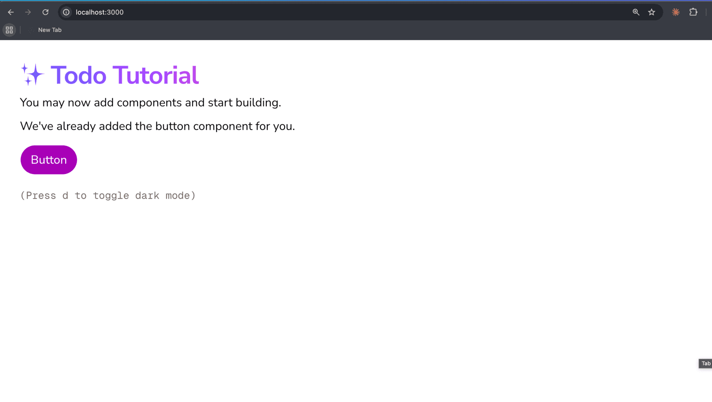
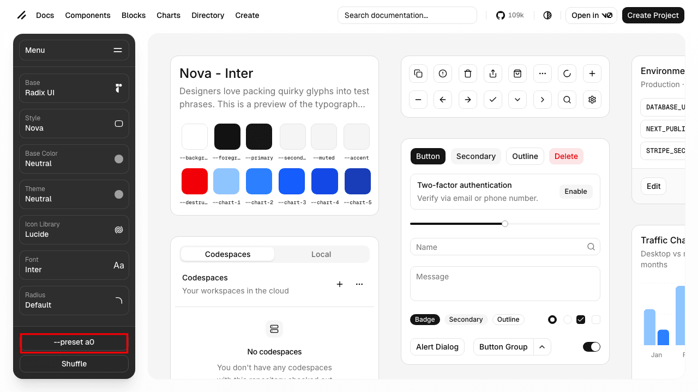

# Claude Code Todo 앱 만들기 | 제대로 배우기

Part 1 · 대화 시작하기Chapter 4 · 첫 프로젝트 실습

# Todo 앱 끝까지 만들어 보기 | 수동 검증의 한계

Todo 앱의 요구사항·Plan Mode·구현·체크리스트 한 사이클을 완주하며, 수동 검증이 사람의 몫으로 남는다는 한계를 체험합니다

Copy MarkdownOpen

마지막 업데이트: 2026\. 7. 6.

## [Overview](#overview)

Plan Mode와 요구사항 작성을 한 사이클로 묶어 Todo 앱을 처음부터 끝까지 만들어 봅니다. Shadcn 디자인을 입히고, CLAUDE.md·요구사항을 준비해 Plan Mode로 계획을 세운 뒤, 브라우저 체크리스트로 결과를 확인합니다.

### [학습 목표](#학습-목표)

*   Shadcn preset으로 디자인 토큰을 적용하고, CLAUDE.md에 담을 내용을 골라 작성할 수 있습니다
*   요구사항과 Plan Mode를 엮어 Todo 앱을 구현할 수 있습니다

### [시작하기 전 확인사항](#시작하기-전-확인사항)

*   실습 프로젝트의 시작 브랜치로 전환합니다. 이 브랜치에는 Next.js + TypeScript + Tailwind CSS 프로젝트가 빈 상태로 준비돼 있습니다.

```
git fetch origin
git checkout ch04-03
bun install
```

## [Step 1: 시작 화면 확인하기](#step-1-시작-화면-확인하기)

`ch04-03` 브랜치에 미리 준비된 Next.js + shadcn 초기 화면이 정상 구동되는지 확인합니다. 초기 화면을 먼저 봐두면 preset 적용 전후를 한눈에 비교할 수 있습니다.

```
bun run dev
```

브라우저에서 `http://localhost:3000` 을 엽니다. Todo Tutorial 안내 화면과 보라색 Button, "Press d to toggle dark mode" 문구가 보이면 시작 상태가 맞습니다.



화면이 뜨지 않으면 시작하기 전 확인사항의 `git checkout ch04-03`·`bun install` 을 다시 실행하고 서버를 재시작하세요.

## [Step 2: Shadcn 디자인 입히기](#step-2-shadcn-디자인-입히기)

Shadcn은 디자인 토큰(색상, 테마, 폰트, 아이콘, 모서리 반경)을 웹에서 시각적으로 설정한 뒤, 그 설정을 **preset**이라는 짧은 코드로 내보냅니다. preset을 프로젝트에 적용하면 이후 설치하는 Shadcn 컴포넌트가 모두 선택한 스타일로 렌더링됩니다.

브라우저에서 [ui.shadcn.com/create](https://ui.shadcn.com/create)에 접속합니다.



왼쪽 사이드바에서 Style, Base Color, Font 등을 자유롭게 고릅니다. 오른쪽 미리보기에서 선택한 스타일이 즉시 적용된 컴포넌트를 확인할 수 있습니다. 사이드바 하단의 **`--preset` 버튼** (예: `--preset a0`)을 누르면 현재 설정의 preset ID가 클립보드에 복사됩니다.

터미널에서 복사한 preset ID로 프로젝트에 적용합니다.

```
bunx shadcn@latest init --preset {preset_id} --force --reinstall -y
```

이 명령은 기존 base 설정을 유지하면서 테마·색상·CSS 변수·폰트·아이콘만 바꾸고, 이미 설치된 컴포넌트도 새 디자인 토큰으로 재설치합니다.

## [Step 3: CLAUDE.md 작성하기](#step-3-claudemd-작성하기)

[CLAUDE.md의 매뉴얼 기준](/learn/starting-conversations/context-management/claude-md#manual-criterion)에서 "모델이 코드에서 찾을 수 없는 것만 추가한다"는 원칙을 세웠습니다. 이번 프로젝트의 매뉴얼도 이 기준으로 정리합니다.

앞 미션에서 만든 `CLAUDE.md` 를 열고 Todo 앱 작업에 필요한 규칙을 더해 다음처럼 정리합니다. 파일이 없다면 프로젝트 루트에 새로 만듭니다.

```
# Todo App

## Architecture
Server Components 우선, 클라이언트 상태는 최소화.

## Workflow
- 패키지 매니저: bun
- 커밋 메시지: Conventional Commits (feat:, fix:, refactor:)

## Rules
- 모든 답변은 한국어로 한다
```

Next.js·TypeScript·Tailwind 같은 기술 스택과 `bun run dev` 같은 실행 명령은 적지 않습니다. 모델이 `package.json` 과 설정 파일에서 그 정보를 직접 읽을 수 있기 때문입니다.

## [Step 4: Plan Mode로 계획 수립하기](#step-4-plan-mode로-계획-수립하기)

[앞 레슨](/learn/starting-conversations/todo-app/requirements)의 두 섹션(**기능 목록**과 **범위 제한**)을 프롬프트에 그대로 적어 Plan Mode에 전달합니다.

`Shift+Tab` 을 두 번 눌러 Plan Mode에 들어간 뒤, 요구사항을 적어 계획을 요청합니다.

```
아래 요구사항대로 Todo 앱을 만들어줘

# Todo 앱 요구사항

## 기능 목록
1. 사용자가 텍스트를 입력하고 Enter 를 누르면, 새 Todo 가 목록 맨 위에 추가된다
2. 사용자가 Todo 항목의 체크박스를 클릭하면, 완료 상태로 표시된다
3. 사용자가 Todo 항목의 삭제 버튼을 클릭하면, 해당 항목이 제거된다
4. 사용자가 Todo 항목을 더블클릭하면, 인라인 편집이 가능하다
5. 페이지 새로고침 후에도 Todo 목록이 유지된다 (localStorage)

## 범위 제한
- 인증/로그인 없음
- 서버 저장 없음 (localStorage 만)
- 드래그 앤 드롭 없음
- 카테고리/태그 없음
```

Plan Mode에서 AI는 코드를 쓰지 않고 프로젝트를 탐색한 뒤 구현 계획을 제시합니다. 돌아온 계획은 완벽한 설계 문서처럼 읽을 필요가 없습니다. 이번 요구사항을 벗어나지 않는지만 확인합니다.

*   **기능 누락**: 요구사항의 다섯 기능이 모두 들어 있는지
*   **범위 초과**: 로그인, 서버 저장, 드래그 앤 드롭, 카테고리 같은 제외 기능이 끼어 있지 않은지
*   **변경 범위**: Todo 앱 구현과 관계없는 파일을 고치겠다고 하지 않는지

계획 중간에 AI가 질문할 수 있습니다

"Todo의 최대 글자 수에 제한이 있나요?", "완료된 항목을 아래로 보낼까요?" 같은 질문이 오면, 요구사항의 빈틈을 AI가 먼저 발견한 것입니다. 답해 주면 됩니다. 질문이 온다는 것은 요구사항이 잘 작성되었다는 신호이기도 합니다. 모호한 요구사항에는 질문 대신 추측이 옵니다.

의도와 다른 부분은 수정을 요청하고, 만족스러운 계획이 나오면 승인합니다. 승인하면 AI가 Plan Mode를 빠져나와 파일을 만들고 Shadcn 컴포넌트를 추가하며 기능을 구현합니다.

## [Step 5: 브라우저에서 검증하기](#step-5-브라우저에서-검증하기)

구현이 끝났다는 메시지가 뜨면 다시 개발 서버를 띄웁니다.

```
bun run dev
```

서버는 AI에게 백그라운드로 실행시키세요

터미널에서 직접 `bun run dev` 를 띄우면 그 터미널이 묶여 다른 작업을 하기 불편합니다. Claude Code에게 "개발 서버를 백그라운드로 띄우고, 로그가 나올 때 알려줘" 라고 요청하면 백그라운드 프로세스로 실행하고 Monitor로 로그를 지켜봅니다. 에러가 발생하면 그대로 읽고 원인을 찾아 줍니다.

브라우저에서 `http://localhost:3000` 을 엽니다. UI가 떠도 모든 기능이 제대로 동작하지 않을 수 있습니다. 요구사항에 적은 동작을 하나씩 직접 확인합니다.

#

시나리오

예상 결과

1

입력 필드에 "장보기" 입력 후 Enter

목록 맨 위에 추가됨

2

빈 입력 상태에서 Enter

추가되지 않음

3

체크박스 클릭

완료 표시 (취소선)

4

삭제 버튼 클릭

해당 항목 제거

5

페이지 새로고침

기존 목록 유지

통과하지 못한 항목이 있으면 AI에게 수정을 요청합니다. "삭제 버튼을 클릭해도 항목이 사라지지 않아. 클릭하면 목록에서 제거되어야 해"처럼 **현재 동작 + 기대 동작**을 함께 알려주면 AI가 더 빠르게 고칩니다.

브라우저 에러는 Claude Code에게 바로 넘기세요

브라우저 콘솔에서 에러를 발견했을 때, 에러 메시지를 복사해 Claude 웹(claude.ai)에 붙여넣지 마세요. Claude Code는 로컬 파일에 직접 접근할 수 있어서, 코드를 읽고 원인을 찾아 수정까지 한 번에 합니다. "브라우저에서 에러가 났어"만 말해도 됩니다.

## [체크리스트를 모두 통과한 뒤](#체크리스트를-모두-통과한-뒤)

기능 추가 →초기 구현기능 5 개필터 추가기능 10 개기능이 쌓이면기능 30 개AI코드 작성사람체크리스트 검증코드 생성기능 구현코드 생성기능 구현코드 생성기능 구현5 항목10 항목30 항목

AI 의 코드 작성 비용은 그대로인데, 사람의 체크리스트는 기능이 쌓일수록 누적됩니다

다섯 시나리오를 모두 통과했습니다. Todo 앱이 요구사항대로 동작합니다. 이제 필터링 기능을 추가한다고 해봅시다. "전체 / 진행중 / 완료" 탭을 추가하면, 필터링 코드가 기존 동작에 영향을 주므로 위 체크리스트를 처음부터 다시 확인해야 합니다. 기능이 하나 추가될 때마다 이 검증 전체를 다시 점검해야 합니다.

지금은 5개지만, 기능이 10개·30개로 늘어나도 시나리오마다 사람이 브라우저에서 하나씩 확인해야 합니다. 작성은 AI가 가져갔지만, 검증은 여전히 사람의 몫입니다. **이제 병목은 "구현"이 아니라 "검증"에 있습니다.**

Part 2는 이 새 병목을 해소하는 과정입니다. 사람이 일일이 점검하던 체크리스트를, AI가 스스로 점검하는 구조로 바꿔 검증까지 자동화하는 방법을 배웁니다.

## [핵심 포인트 정리](#핵심-포인트-정리)

1.  **CLAUDE.md·요구사항**: 모델이 코드에서 찾을 수 없는 결정·워크플로우·제약만 CLAUDE.md에, "무엇을 만들고 무엇을 안 만들지"를 요구사항에 담습니다
2.  **요구사항 → 검증 사이클**: 요구사항 → Plan Mode → 계획 검토 → 구현 → 검증 순으로 진행하면 AI가 추측 대신 계획에 따라 코드를 씁니다
3.  **완료 메시지 ≠ 동작 보장**: AI가 "완료"라고 말해도 실제 동작 확인은 사람의 몫입니다
4.  **반복 검증 비용**: 기능이 늘수록 체크리스트도 길어지고, 기능 하나 추가할 때마다 전체를 다시 점검해야 합니다. Part 2는 이 반복을 줄이는 방법을 다룹니다

## [FAQ](#faq)

### AI가 만든 코드에 버그가 있으면 어떻게 하나요?

### 모든 기능을 한 번에 구현해도 되나요?

## [이어서 배울 내용](#이어서-배울-내용)

Todo 앱을 요구사항부터 검증까지 직접 만들어 보고, 마지막에 수동 체크리스트의 한계까지 눈으로 확인했습니다. Part 1에서 지나온 네 챕터(LLM 기초, Claude Code 인터페이스, Context 관리, Plan Mode 사이클)를 다음 레슨에서 한 장으로 정리합니다.

*   Part 1 네 챕터의 큰 테마 복습
*   Part 2가 풀 문제의 예고

피드백 남기기

[

읽기 먼저, 쓰기는 나중에 | Plan Mode

프로젝트 구조를 읽지 않은 AI가 추측으로 코드를 쓰지 않도록, Plan Mode로 탐색·계획·승인 흐름을 익힙니다

](/learn/starting-conversations/todo-app/plan-mode)[

Part 1 정리

Part 1에서 배운 LLM 한계, Claude Code 기본 흐름, Context 관리, 요구사항·검증 사이클을 정리합니다

](/learn/starting-conversations/wrap-up)

---
Source: https://docs.claude-hunt.com/learn/starting-conversations/todo-app/todo-implementation
